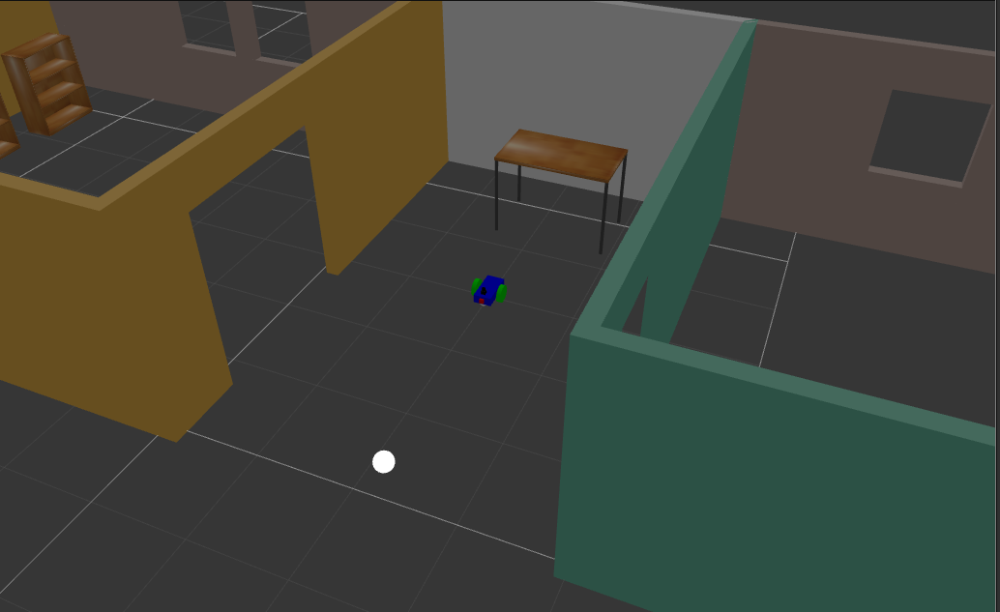
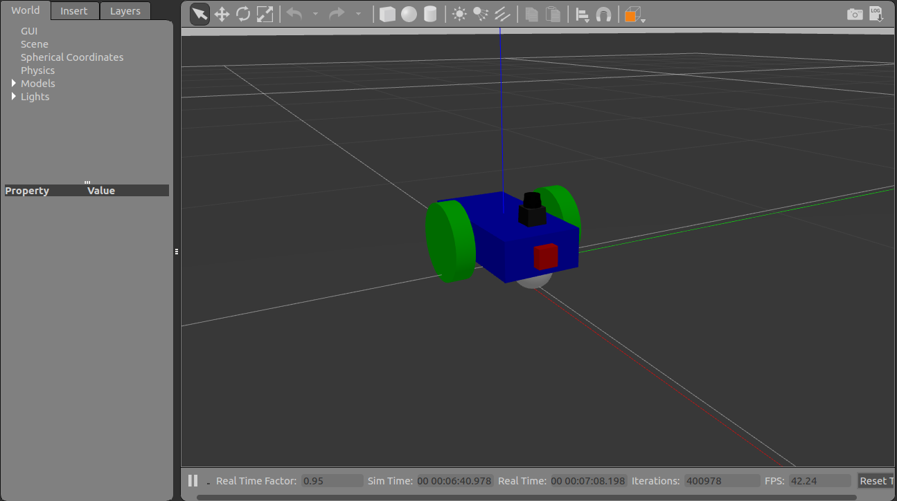
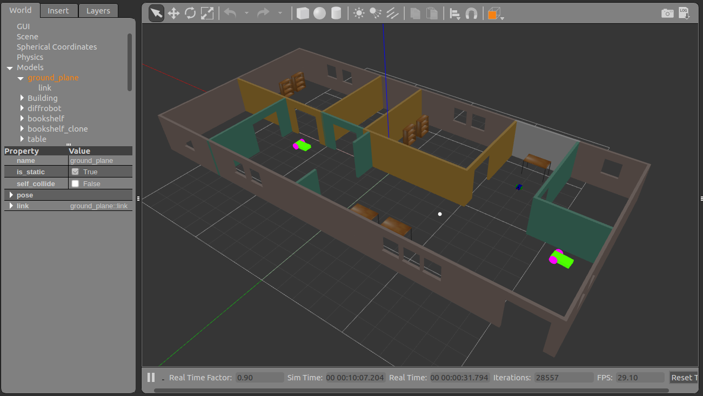

# Ball_chasing_robot_in_gazebo
Designed the differential drive robot, house it inside created world, and programmed it to chase white-colored ball.

## Project Aim :
1. Setting up my_robot (urdf of the robot  model)
2. setting up sensors and actuators (camera, lidar and differential drive plugin)
3. Rviz integration for visualization
4. Importing the my_house designed using gazebo
5. writing drive node and image process node in cpp
6. Finally, made the robot to the follow white color ball

## Images
**Ball with robot**

**Differential drive robot with camera and Lidar**

**Importing my_house to the world**

